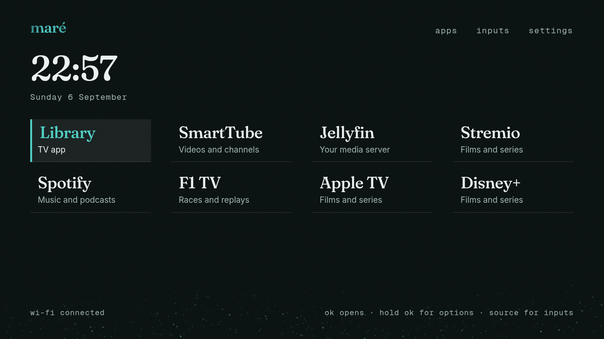

# Maré Launcher

A quiet home for your television. Your apps, a clock, a little sand and the horizon.

Maré replaces the home screen on **TCL Android TV and Google TV** with your favourite apps and no advertising. It also works with compatible Android TVs from other brands. Free, open source, and available as an APK.

**[Download APK](https://github.com/mare-rio/mare-launcher/releases/latest/download/mare-launcher.apk)** · **[Download guided installer](https://github.com/mare-rio/mare-launcher/releases/latest/download/mare-launcher-install.zip)**

## Install on your TCL TV

The guided installer sets Maré as the screen your TV opens when you press **Home**. You need a Windows, Mac or Linux computer on the same home network as your TV. Your apps and their settings stay in place.

1. **[Download the installer ZIP](https://github.com/mare-rio/mare-launcher/releases/latest/download/mare-launcher-install.zip)** and extract it.
2. In the extracted folder, run **`sh install.sh`** on macOS/Linux, or **`.\install.cmd`** in Windows Terminal. You need [Python 3.9 or newer](https://www.python.org/downloads/).
3. Follow the terminal instructions to enable debugging on the TV, then enter the **TV IP address**. Setup finds the connection automatically and guides any authorization needed. After installation, press **Home** on your remote. In Maré, open **Apps**, hold **OK** on an app and choose **Pin to home**.

[Read the installation guide](docs/INSTALLATION.md) · [Install just the APK](docs/INSTALLATION.md#install-just-the-apk) · [Release notes](https://github.com/mare-rio/mare-launcher/releases/latest)

For **Android TV 8 or newer / Google TV**. TCL Roku TVs cannot run Android APKs. Setting the default Home requires network debugging support; some firmware restricts it. [Compatibility and tested devices](docs/COMPATIBILITY.md).

## Make it yours

Pin up to twelve favourites. Choose day or night colours, and turn **Motion** off for a simpler experience on slower TVs. The remote’s arrow keys and OK do everything; hold OK on an app to pin, move or remove it from Home. Dates use day–month order and the clock uses 24-hour time.

Maré has no accounts, tracking or internet permission. It removes home-screen recommendations and ads; advertising inside other apps is unaffected. To go back, run the same installer and choose **Restore my previous Home screen**.

## Contribute

[Build from source](docs/BUILDING.md) · [Contributing](CONTRIBUTING.md) · [Report a bug](https://github.com/mare-rio/mare-launcher/issues) · [Report a security issue](SECURITY.md)

[MIT licence](LICENSE). Fonts and dependencies retain their [own licences](THIRD_PARTY_NOTICES.md). Independent project, unaffiliated with TCL or Google.
