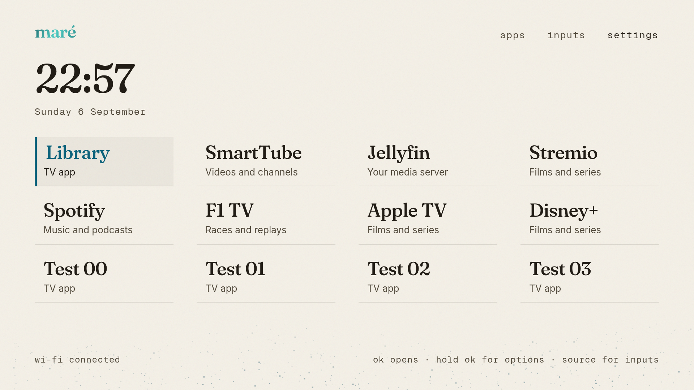

# Maré Launcher

A quiet home for your television. Your apps, a clock, a little sand and the horizon.

Maré is an ad-free launcher for Android TV and Google TV. Pin up to twelve favourites, move through your apps with the remote, and choose a light or dark appearance. It uses the Maré design system’s typography and materials, with an English interface, day–month dates and a 24-hour clock.


**Release status: source available; 0.3.0 is a prerelease candidate. No installable release has been published yet.** Signing and release validation are still in progress. The instructions below describe the prepared installation bundle; developers can [build from source](docs/BUILDING.md).

## Install on your TV

You need a computer with Python 3.9 or later, a TV on the same network, and about ten minutes to enable debugging. No root or bootloader unlock is needed.

1. Extract the complete `mare-launcher-0.3.0-install.zip` when a reviewed bundle is available.
2. Follow the [TV preparation guide](docs/INSTALLATION.md). It covers ordinary network debugging and wireless pairing.
3. Windows: open `install.cmd`. macOS: open Terminal in the extracted folder and run `sh install.command`. Linux: run `sh install.sh`.
4. Follow the prompts. The installer can obtain Google’s ADB tools, checks the chosen TV, saves recovery information and installs Maré as Home.
5. In Maré, open **Apps**, hold **OK** on an app and choose **Pin to home**. Turn debugging off when finished.

Some firmware forces the Google launcher to stay active. The guide explains the explicit, reversible fallback. The installer does not uninstall your streaming apps or reset their data. Ads inside other apps are unaffected.

**Compatibility:** Android TV 8.0+ / Google TV with accessible ADB and a working, updated Android System WebView. Manufacturer restrictions still apply; support for every model is not proven. See the [tested devices and limitations](docs/COMPATIBILITY.md).

## Everyday controls

| Remote control | Action |
| --- | --- |
| D-pad / OK | Move and open |
| Hold OK or Menu on an app | Pin, unpin, reorder, open or view app details |
| Back | Close the current menu or pane |
| Home | Return to your favourites |
| Source / Input | Open inputs if the TV delivers this button to Maré |

Settings includes appearance, Motion, and shortcuts to the TV’s own settings. On a slower TV, start with Motion off and only the favourites you use. This is the same launcher on every device; performance improvements depend on the TV and its WebView.



## Restore your previous launcher

Enable debugging again and run this in the extracted folder, replacing the example address with your TV’s address:

```sh
python3 install.py restore --target 192.0.2.10
```

On Windows use `py -3` instead of `python3`. This restores the original Home selection and only the Google Home package states changed by this installer. Add `--remove` to also remove Maré and its preferences. Keep the recovery file whose location the installer prints; it is stored separately from the ZIP. [Recovery details](docs/INSTALLATION.md#restore-and-remove).

## Build and contribute

One Java Android shell hosts a bundled React surface. There is no private package registry, service account, analytics service or runtime internet permission. Fonts, sand and necessary Maré components are included in the source.

See [building and local signing](docs/BUILDING.md), [contributing](CONTRIBUTING.md) and the [CI security model](docs/CI_SECURITY.md). CI produces an unsigned production build; signing and publication are separate local operations.

The launcher and the Maré-owned copies included here are [MIT licensed](LICENSE). Fonts and dependencies retain their own licences; see [third-party notices](THIRD_PARTY_NOTICES.md). This licence does not relicense the separate Maré Design System repository. Android, Google TV and other app names belong to their respective owners; this is an independent project.
